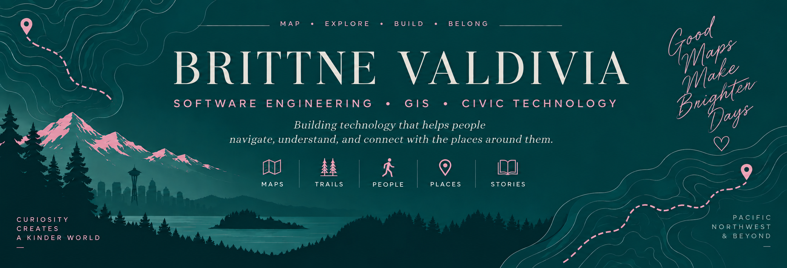

  

I'm a software engineering student exploring the intersection of **software development, GIS, and place-based technology**.

I'm especially interested in building tools that help people **navigate, understand, and connect with the places around them** — from better bicycle and pedestrian experiences to interactive maps that bring local history and stories into the landscape.

I'm also exploring how **AI can enhance spatial applications**, including smarter routing, location-aware experiences, and new ways of interacting with geographic and historical data.

---

## 🗺️ What I'm Interested In

🚲 **Transportation & Routing**  
Using elevation, infrastructure, surface conditions, and local GIS data to create more useful bicycle and pedestrian routing experiences.

🥾 **Trails & Place-Based Storytelling**  
Exploring location-aware walking experiences where maps and audio can surface stories, history, and cultural context as people move through a place.

🤖 **AI + Geospatial Technology**  
Learning how AI can work alongside GIS to interpret spatial data, personalize experiences, and make geographic information easier to explore.

🏙️ **Civic Technology**  
Building practical tools with public and municipal data that improve how people understand and interact with their communities.

---

## 🔨 Currently Building

### 🚲 Eastside Bike Routing

A civic GIS prototype exploring how local open data, elevation, trails, and bicycle infrastructure can be combined to compare routes based on more than just distance.

**Current stack:** QGIS • USGS elevation data • municipal GIS data • Git/GitHub

**Coming next:** Leaflet • PostGIS • spatial SQL • cyclist research • route comparison
