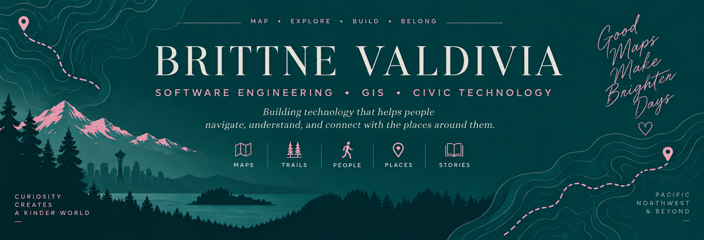

  

I'm a software engineering student focused on the intersection of **software development, GIS, and interactive geospatial technology**.

I'm interested in building applications that help people **navigate, understand, and connect with the places around them** — from better bicycle and pedestrian routing to interactive maps that make complex spatial data easier to explore.

My current work combines **web development, municipal GIS data, spatial analysis, and digital cartography**. I'm especially interested in turning real-world geographic data into useful, accessible web experiences and exploring how emerging technologies such as AI can enhance spatial applications.

---

## 🗺️ What I'm Interested In

🚲 **Transportation & Routing**  
Using elevation, infrastructure, surface conditions, and municipal GIS data to build more useful bicycle and pedestrian routing experiences.

🌎 **Interactive Maps & Spatial Visualization**  
Building web-based maps and visualizations that turn complex geographic data into clear, understandable, and engaging experiences.

🥾 **Trails & Place-Based Storytelling**  
Exploring location-aware experiences where maps, audio, history, and cultural context can connect people more deeply with a place.

🏙️ **Civic Technology**  
Building practical software with public and municipal data that improves how people understand and interact with their communities.

🤖 **AI + Geospatial Technology**  
Exploring how AI can complement GIS through spatial data interpretation, location-aware experiences, and new ways of interacting with geographic information.

---

## 🔨 Currently Building

### 🚲 Eastside Bike Routing

A GIS + software engineering prototype exploring how municipal open data, elevation, trails, streets, and bicycle infrastructure can be combined to compare bicycle routes based on more than distance.

The project currently uses real municipal GIS datasets and USGS elevation data to explore bicycle infrastructure, terrain, slope, surface conditions, and network characteristics.

**Current stack:** QGIS • USGS 3DEP • municipal GIS data • Git/GitHub

**Building toward:** TypeScript • ArcGIS Maps SDK for JavaScript • interactive spatial visualization • PostGIS • spatial SQL • cyclist research • route comparison
